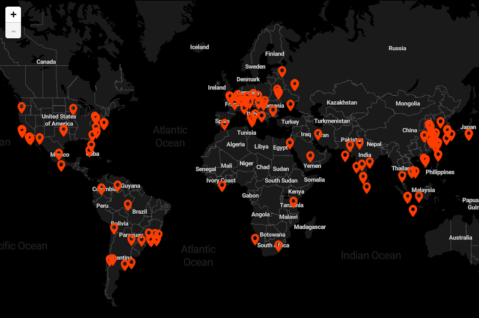

# SSH Bruteforce Map
This is a simple gui for viewing ssh failed logs



## Prerequisites
### Python3 & Nodejs & npm
```
sudo apt install python3 nodejs npm
```

### SQL Database
```sql
CREATE TABLE `logs` (
  `id` int(11) NOT NULL,
  `ip` varchar(15) COLLATE utf8mb4_unicode_ci NOT NULL,
  `lat` float NOT NULL,
  `lng` float NOT NULL,
  `attempts` int(11) NOT NULL,
  `date` date NOT NULL
) ENGINE=InnoDB DEFAULT CHARSET=utf8mb4 COLLATE=utf8mb4_unicode_ci;


ALTER TABLE `logs`
  ADD PRIMARY KEY (`id`);


ALTER TABLE `logs`
  MODIFY `id` int(11) NOT NULL AUTO_INCREMENT;
COMMIT;
```

## Setup
```
npm install
```

### Usage :
```
node server.js
```
